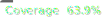

# Portfolio

[](https://github.com/arcangelo7/portfolio/actions/workflows/test.yml)
[](https://arcangelo7.github.io/portfolio/test/coverage/)
[](https://flutter.dev)

A responsive Flutter portfolio website showcasing my professional profile and skills.

**🌐 Portfolio Website**: [https://arcangelo7.github.io/portfolio/](https://arcangelo7.github.io/portfolio/)

## Features

- Multi-language support (English, Italian, Spanish)
- Dark/Light theme toggle
- Responsive design for all platforms
- Modern Material 3 design
- Cross-platform compatibility

## Installation

1. Clone the repository
2. Install dependencies: `flutter pub get`
3. Run the app: `flutter run`

## Testing

Run tests with coverage (auto-excludes generated files):

```bash
./test/test_coverage.sh --html
```

**📊 Test Coverage**: View detailed coverage report at [https://arcangelo7.github.io/portfolio/test/coverage/](https://arcangelo7.github.io/portfolio/test/coverage/)

## Supported Platforms

- Web
- Android
- iOS
- Linux
- macOS
- Windows
